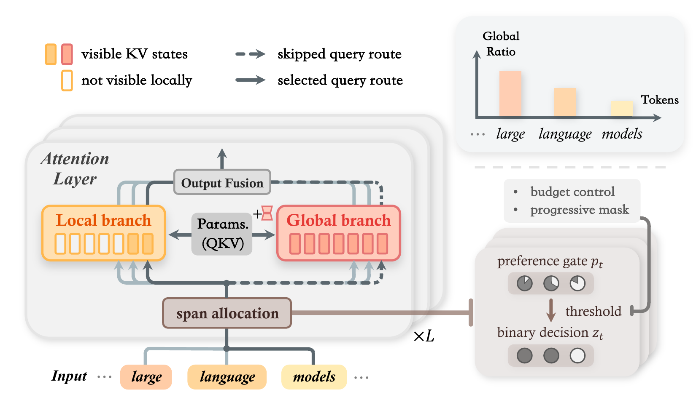

# LoGo: Token-Level Dynamic Local-Global Attention

LoGo is a token-level dynamic local-global attention mechanism for improving
the long-context performance-compute trade-off of decoder-only language models.
It uses attention span as a direct proxy for attention budget allocation: every
token receives efficient local attention, while a learned gate selectively
activates full-context global attention for tokens requiring long-range
information.



## Highlights

- **Token-level span allocation.** LoGo routes each token between local-only and
  local-plus-global attention under a controlled global budget.
- **Coupled local/global branches.** The two branches share the main attention
  projections and use lightweight transformations for branch specialization.
- **Budget control without auxiliary loss.** A threshold-based controller keeps
  the global activation ratio near a target budget.
- **Stable sparse routing.** Progressive masking lets the gate and both branches
  learn from dense supervision before sparse global routing takes effect.
- **Query-sparse implementation.** Triton kernels compute the global branch only
  for selected query rows, turning reduced attention FLOPs into practical
  speedups.

## Repository Layout

```
LoGo/
├── logo/
│   ├── __init__.py                 # package exports + Auto* registration
│   ├── configuration_logo.py       # LoGoConfig
│   ├── modeling_logo.py            # LoGoModel / LoGoForCausalLM
│   ├── cache.py                    # local/global KV cache utilities
│   ├── layers/
│   │   ├── attn.py                 # standard full-attention layer
│   │   ├── logo.py                 # LoGo attention layer
│   │   └── utils.py                # flash-attention dispatch helpers
│   ├── modules/
│   │   ├── layernorm.py            # RMSNorm
│   │   ├── rotary.py               # rotary position embedding
│   │   └── mlp.py                  # SwiGLU MLP
│   └── ops/
│       ├── selected_full_attn.py   # query-sparse full attention
│       ├── dense_full_attn.py      # dense reference implementation
│       ├── common.py               # selection and launch helpers
│       └── triton_utils.py         # Triton helper functions
├── configs/
│   └── config_1b5.json             # reference 1.5B configuration
├── tests/
│   └── test_model.py               # build / forward / generation smoke test
├── requirements.txt
├── setup.py
└── LICENSE
```

## Installation

```bash
git clone <repo-url>
cd LoGo
pip install -e .
pip install flash-attn --no-build-isolation
```

Main requirements:

- Python >= 3.9
- PyTorch >= 2.1
- Transformers >= 4.44 and < 4.52
- Triton >= 3.0
- flash-attn >= 2.1

The flash-attention and Triton paths require a CUDA GPU.

## Quickstart

```python
import torch
from logo import LoGoConfig, LoGoForCausalLM

config = LoGoConfig(
    vocab_size=32000,
    hidden_size=2048,
    intermediate_size=5632,
    num_hidden_layers=24,
    num_attention_heads=16,
    num_key_value_heads=16,
    max_position_embeddings=8192,
    window_size=128,
    global_qk_param="linear_proj",
    sparse_full_attn_backend="flash",
    gate_thres_init=0.5,
)

model = LoGoForCausalLM(config).cuda().to(torch.bfloat16)
input_ids = torch.randint(0, config.vocab_size, (1, 512), device="cuda")
outputs = model(input_ids)
print(outputs.logits.shape)
```

You can also load the reference configuration:

```python
from logo import LoGoConfig, LoGoForCausalLM

config = LoGoConfig.from_pretrained("configs/config_1b5.json")
model = LoGoForCausalLM(config)
```

The package registers `LoGoConfig` and `LoGoForCausalLM` with the Hugging Face
Auto classes when `logo` is imported.

## Key Configuration Options

| Field | Default | Description |
|---|---:|---|
| `window_size` | `128` | Sliding-window size for the local branch. |
| `attn_type_list` | all `0` | Per-layer attention type. `0` selects LoGo attention; other values select standard full attention. |
| `global_qk_param` | `"scale_offset"` | Global-branch Q/K/V transformation: `"scale_offset"` or `"linear_proj"`. |
| `sparse_full_attn_backend` | `"flash"` | Global branch backend: dense flash attention (`"flash"`) or query-sparse Triton (`"triton"`). |
| `gate_thres_init` | `0.5` | Initial threshold for token-level global activation. |
| `use_context_norm` | `True` | Apply branch-specific RMSNorm before output fusion. |

Setting `sparse_full_attn_backend="triton"` enables `logo.ops.sq_full_attn`,
which computes full-context attention only for selected query rows while
preserving dense-attention semantics on those rows.

## Smoke Test

```bash
python tests/test_model.py
```

The smoke test builds the reference model and checks regular training forward,
packed variable-length forward with `cu_seqlens`, and generation paths. It
requires a CUDA GPU with flash-attention and Triton installed.

## Citation

TODO: add BibTeX after the paper/arXiv version is available.

## License

This project is released under the Apache License 2.0. See [LICENSE](LICENSE)
for details.
